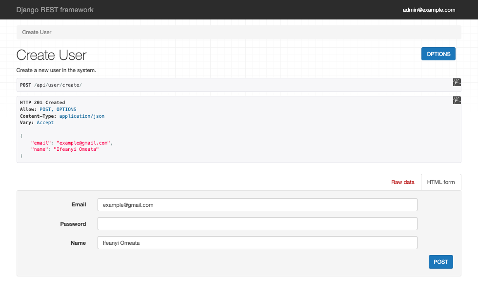
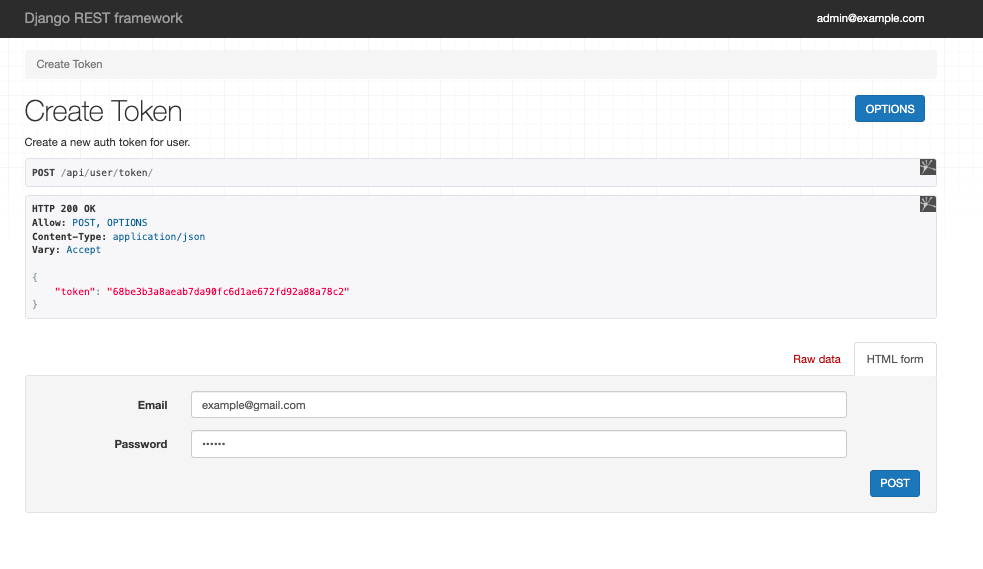
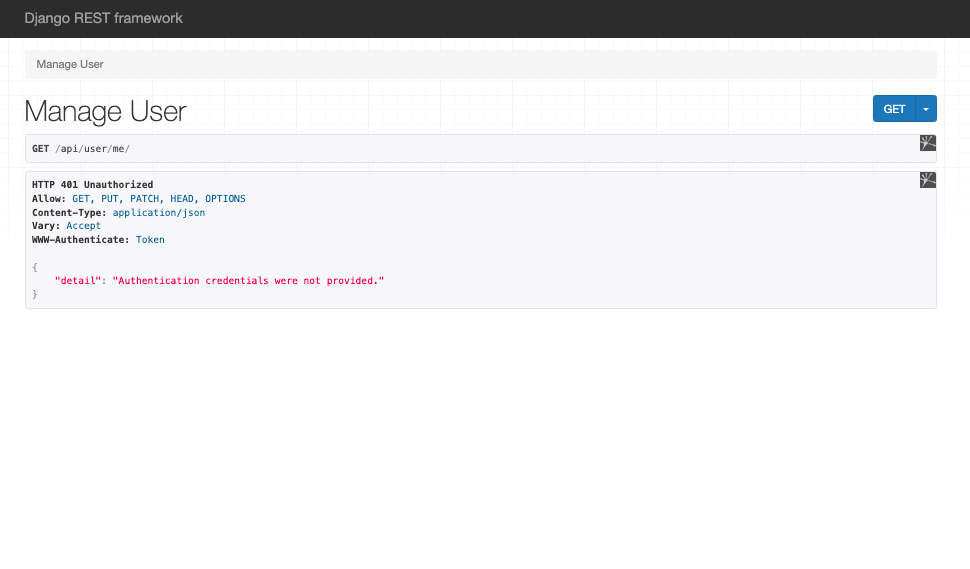
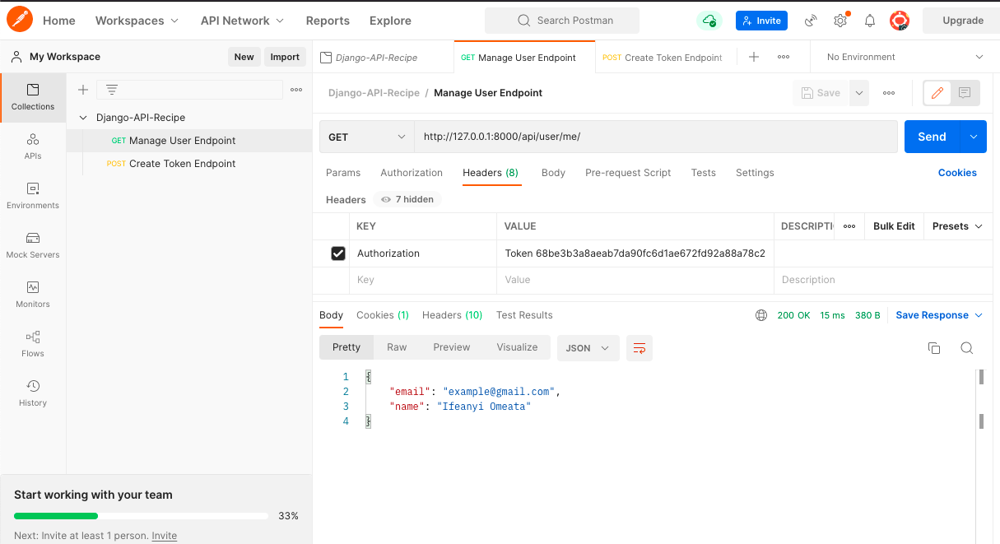
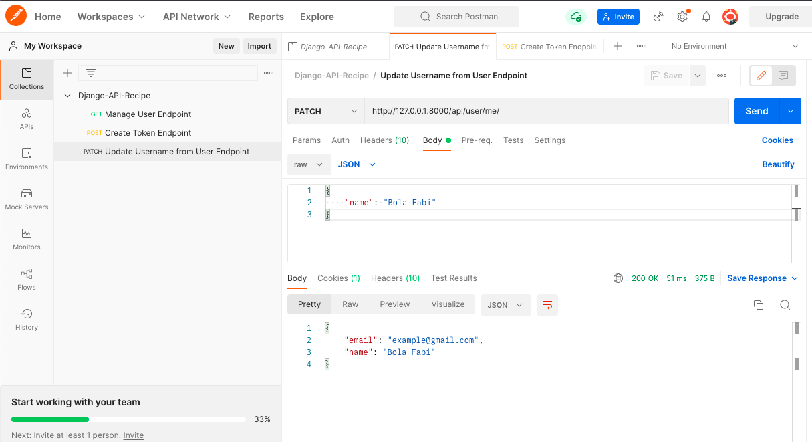
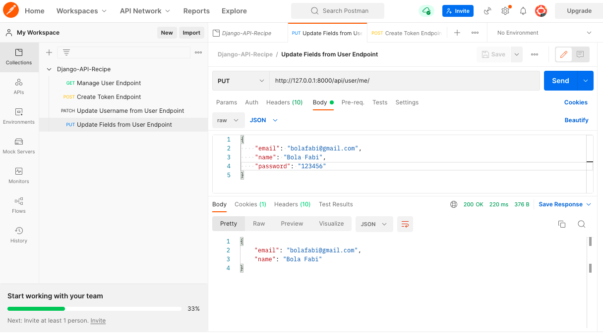

# Django-API-Recipe-App

Django-API-Recipe Project By Ifeanyi Omeata

---

### [1-SETUP](#)

---

### 1. Create-ENV

```python
  pipenv shell
```

### 2. Install Django dependencies

```python
  pipenv install django djangorestframework django-shortcuts
```

### 3. Create Core Project

```python
  django-admin startproject coreproject .
```

### 4. Create Core App

```python
  python manage.py startapp core
```

### 5. Register Core App in Settings - [here](https://github.com/omeatai/Django-API-Recipe-App/commit/923774964d24437b8399a77846bc901e71f4b868)

### 6. Install Autopep8

```python
  pipenv install autopep8
```

---

### [2-CREATE USER MODEL](#)

---

### 1. Test_create_user_with_email_successful - [here](https://github.com/omeatai/Django-API-Recipe-App/commit/0f655a703c374b75b9874a0e641a4b7a0854f96b)

### 2. Create User and User Manager Models - [here](https://github.com/omeatai/Django-API-Recipe-App/commit/3214f5252f3d85ee5b3a8a22f08d5db728ad24b4)

### 3. Django Make Migrations

```python
  python manage.py makemigrations
```

### 4. Django Migrate

```python
  python manage.py migrate
```

### 5. Run Django Test

```python
  python manage.py test
```

### 6. Test_new_user_email_normalized - [here](https://github.com/omeatai/Django-API-Recipe-App/commit/8a519dc854280b3e4b8ec00b658b281a1339c9c9)

### 7. Test_new_user_without_email_raises_error - [here](https://github.com/omeatai/Django-API-Recipe-App/commit/94feda343f9e687b13a7b9a9f5cbddc71bed22e0)

### 8. Test_create_superuser - [here](https://github.com/omeatai/Django-API-Recipe-App/commit/658169fa3787777e26164acb7fa3fbd5663e30a1)

### 9. Test_users_lists - [here](https://github.com/omeatai/Django-API-Recipe-App/commit/25cd1011848308d1a8e65fe24e0ca19d9679a963)

### 10. Define the admin pages for users - [here](https://github.com/omeatai/Django-API-Recipe-App/commit/aeab95a26eb124684e4e9ab135506a4b4dd23e6f)

### 11. Test_edit_user_page - [here](https://github.com/omeatai/Django-API-Recipe-App/commit/d11d7b84d0694a9f9b587f89673c119e30cf4604)

### 12. Test_create_user_page - [here](https://github.com/omeatai/Django-API-Recipe-App/commit/0894b4d76c7e0580b8f9a0ac6a2b6ef2a5ccada2)

---

### [3-CREATE USER API](#)

---

### 1. Create User App

```python
  python manage.py startapp user
```

### 2. Add User App and Rest Framework to settings - [here](https://github.com/omeatai/Django-API-Recipe-App/commit/d81eeb5a6cac67ef010d2996e73d287a5073d3f7)

### 3. Test_create_user_Api - [here](https://github.com/omeatai/Django-API-Recipe-App/commit/0796c8a5c5fecde6d662b37d90a054d3171fd4b8)

### 4. Create User Api Serializer and URL - [here](https://github.com/omeatai/Django-API-Recipe-App/commit/19a16b68623b64ed24721313701610c24d200578)

### 5. Test for User Token - [here](https://github.com/omeatai/Django-API-Recipe-App/commit/ccd2c78e2842137ec3015a2caee9b6464c604f87)

### 6. Create User Token - [here](https://github.com/omeatai/Django-API-Recipe-App/commit/93224826e8677047edae84106f5e1e6bb417ac42)

### 7. Test for manage user Api - [here](https://github.com/omeatai/Django-API-Recipe-App/commit/43c98c0edbe89101c49d706c5f5d8e685c05f503)

### 8. Manage User Api - [here](https://github.com/omeatai/Django-API-Recipe-App/commit/437b9078f7dced5705695d168f64a548edfa1584)

```python
  python manage.py migrate
```

```python
  python manage.py test
```

```python
  python manage.py runserver
```

### 9. Create Super User -

```python
  python manage.py createsuperuser
```

```python
  admin@example.com
  123456
```

### 10. Test Create User Endpoint -

```python
  http://127.0.0.1:8000/api/user/create/
```

<details>
  <summary>Click to expand!</summary>



</details>

### 11. Test Create Token Endpoint -

```python
  http://127.0.0.1:8000/api/user/token/
```

<details>
  <summary>Click to expand!</summary>



</details>

### 12. Test Manage User Endpoint -

```python
  http://127.0.0.1:8000/api/user/me/
```

<details>
  <summary>Click to expand!</summary>




</details>

### 13. Update (PATCH) Username in User Endpoint -

```python
  http://127.0.0.1:8000/api/user/me/
```

<details>
  <summary>Click to expand!</summary>



</details>

### 14. Update (PUT) Fields in User Endpoint -

```python
  http://127.0.0.1:8000/api/user/me/
```

<details>
  <summary>Click to expand!</summary>



</details>

---

### [4-CREATE RECIPE API](#)

---

### 1. Test for Create Recipe - [here](https://github.com/omeatai/Django-API-Recipe-App/commit/3578ea2caf7af47a35eb406158ffb4e1a4fed75e)

### 2. Create Recipe Model - [here](https://github.com/omeatai/Django-API-Recipe-App/commit/3fd37c9b26c408b6adbc53fd6fca2f6b91356515)

```python
  python manage.py makemigrations
```

```python
  python manage.py migrate
```
